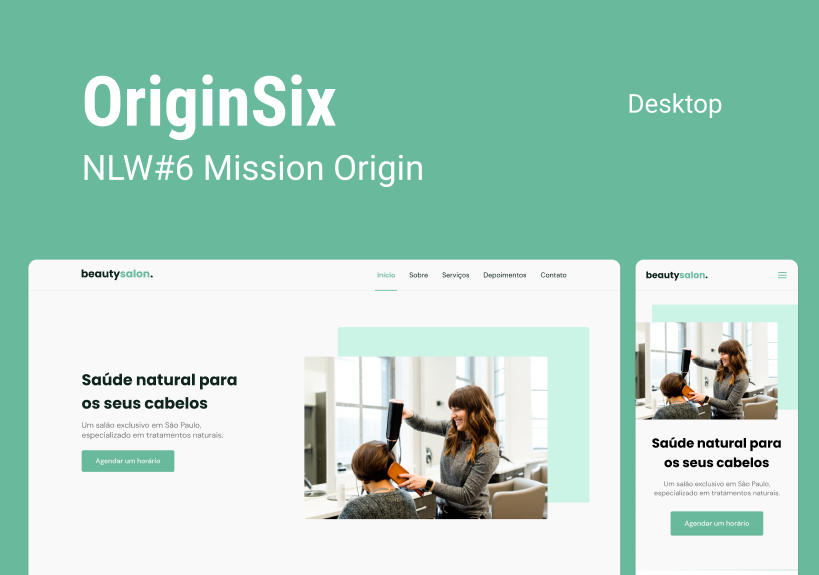

<h1 align="center">
    <strong>beautysalon.</strong>
</h1>

<h1 align="center">
    
</h1>

# 💻 Sobre o projeto
A plataforma **beautysalon.** foi desenvolvida pensando em uma página comercial, no qual são apresentados dados e formas de contato, seu objetivo é divulgar o salão. É totalmente responsiva e facilmente adaptável para outros projetos.

Projeto desenvolvido durante a 🚀 **NLW - Next Level Week** 🚀 - Oferecida pela **Rocketseat**

---

## 🚨 Como baixar o projeto
Antes de começar, você vai precisar ter um editor para trabalhar com o código como VSCode

### 🏁 Para rodar a aplicação 

```bash

    # Clonar o repositório
    $ git clone https://github.com/milealmeida/nlw-origin-originsix

    # Entrar no diretório
    $ cd {nomepasta}

    # Para abrir o Visual Studio Code
    $ code .

    # Utilize um servidor como o Live Server para rodar o projeto

```

---
Desenvolvido por Milena Almeida 💙